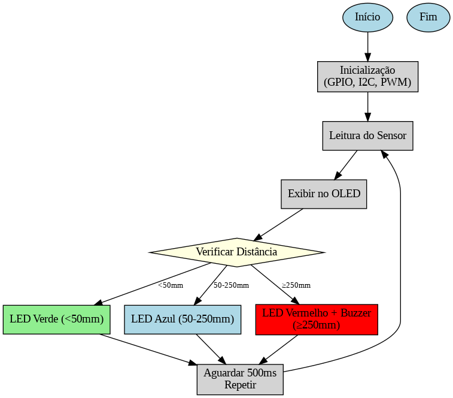
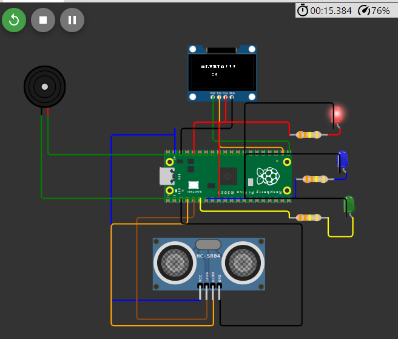
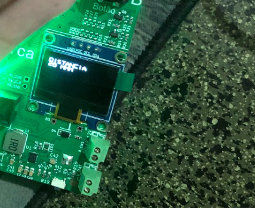
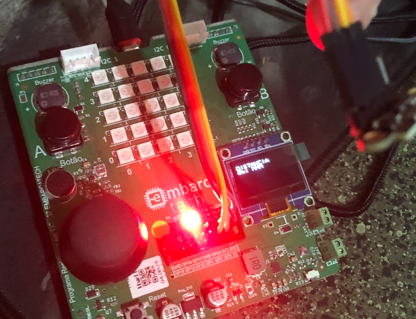
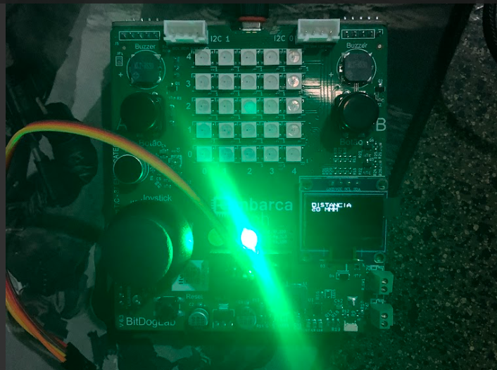

# 🌊 Projeto Final - Embarca Tech  
## Monitoramento de Níveis de Água com Sensor VL53L0X e BitDogLab  

Este projeto tem como objetivo criar um sistema de monitoramento em tempo real dos níveis de água, utilizando o sensor **VL53L0X** e a placa **BitDogLab (Raspberry Pi Pico)**.  
O sistema mostra os dados em um display OLED e utiliza LEDs + buzzer para alertar sobre situações críticas.  

---

## 📌 Links Importantes  
- 🎥 [Vídeo do Projeto e Explicação do Código](https://projetoleobraz.netlify.app/)  
- 💻 [Código do Projeto](https://rococo-longma-ef9fbe.netlify.app/)  
- 🔗 [Simulação no Wokwi](https://wokwi.com/projects/422372086727932929)  

---

## 📐 Fluxograma do Sistema
O fluxograma abaixo mostra a lógica de funcionamento:  

---

## 🔌 Esquema Virtual (Wokwi)
Representação do circuito virtual montado no **Wokwi**:  

---

## 🖥️ Display OLED em Funcionamento
O sistema exibe a distância medida em tempo real:  

---

## 🚨 Alertas Visuais e Sonoros
O sistema utiliza LEDs e buzzer para indicar a situação:  

- 🔴 **Crítico (≥ 250 mm): LED Vermelho + Buzzer**  

- 🟢 **Baixo (< 50 mm): LED Verde**  

---

## ⚙️ Funcionamento Resumido
1. O sensor **VL53L0X** mede a distância (nível da água).  
2. A placa **BitDogLab** processa os dados via I2C.  
3. O **display OLED** exibe os valores em tempo real.  
4. LEDs indicam o estado:  
   - 🟢 Verde → Nível ideal  
   - 🔵 Azul → Alerta médio  
   - 🔴 Vermelho + 🔔 Buzzer → Situação crítica  

---

## 📊 Resultados
✅ Mediões consistentes com o sensor VL53L0X.  
✅ Alertas visuais e sonoros funcionando corretamente.  
✅ Projeto validado tanto na **placa física** quanto na **simulação Wokwi**.  

---

## 🚀 Trabalhos Futuros
- Integração com Wi-Fi para envio dos dados a um servidor/nuvem.  
- Implementar sistema de irrigação automática.  
- Notificações via SMS/WhatsApp em caso de alerta crítico.  

---

## 📸 Demonstrações Reais
- OLED exibindo distância medida.  
- LEDs em funcionamento conforme nível de água.  
- Testes feitos tanto no simulador quanto no hardware real.  

---

## 👨‍💻 Autor
**Leonardo Alves Braz**  
Projeto desenvolvido no **Programa Embarca Tech - IFCE**.  
